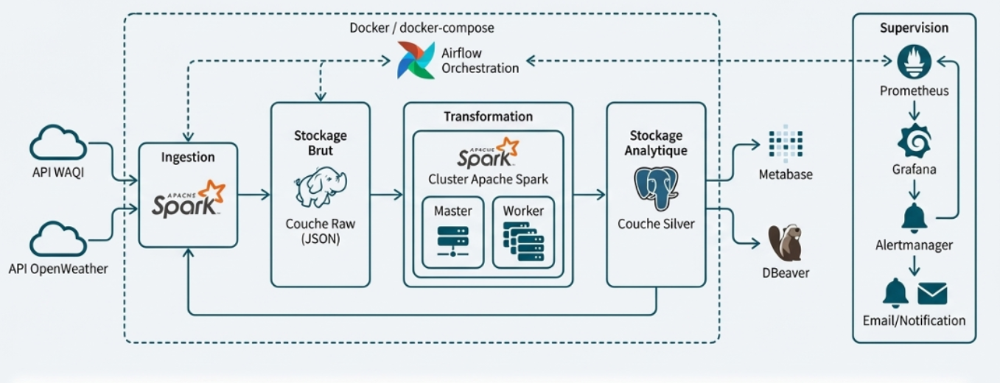

# GoodAir Data Platform

## Overview
GoodAir Data Platform is an end-to-end Big Data project designed to collect, store, transform and analyze environmental data.

The platform ingests air quality and weather data from public APIs, stores raw JSON files in HDFS, transforms the data with Apache Spark, loads structured datasets into PostgreSQL, and exposes analytics through Metabase dashboards.

## Architecture

## Technologies
- Apache Spark
- Apache Airflow
- Hadoop HDFS
- PostgreSQL
- Docker / Docker Compose
- Prometheus
- Grafana
- Alertmanager
- Metabase
- Python

## Pipeline
1. Data ingestion from WAQI and OpenWeather APIs
2. Raw storage in HDFS as JSON files
3. Transformation with PySpark
4. Loading into PostgreSQL Silver layer
5. Visualization in Metabase
6. Monitoring with Prometheus and Grafana

## Data Model
Main analytical tables:
- dim_city
- air_quality_current
- weather_current
- air_quality_forecast

## Key Features
- Automated hourly ingestion
- Raw data historization
- ELT pipeline architecture
- Distributed processing with Spark
- Monitoring and alerting
- Interactive dashboards

## Project Documents
- [Project report](docs/rapport-goodair.pdf)

## Author
Kenza Lamrani
Data Engineer
